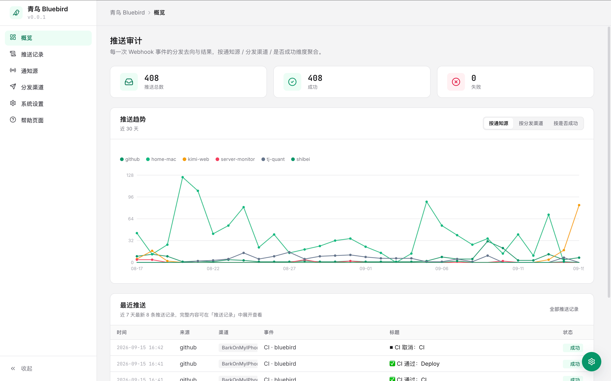
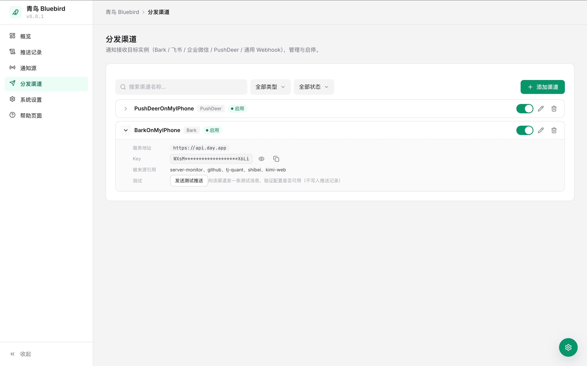

# 青鸟 Bluebird


[](LICENSE)
[](https://github.com/Angryshark128/bluebird/actions/workflows/ci.yml)

Webhook → 多渠道通知网关：把 **GitHub 仓库事件**（star / fork / issue / 评论 / PR / CI 结果）和**通用 HTTP 调用**实时推送到手机 / IM（Bark、飞书、企业微信、PushDeer，或任意通用 Webhook，可多路并行）。

> **青鸟** 寓意「信使」：把消息准确送达。环境变量名沿用 `NOTIFY_*` 前缀。

- **多信息源**：GitHub（账号级订阅，一次配置覆盖所有仓库）与通用来源（任意 HTTP POST，适合脚本 / 监控 / CI），均支持多实例
- **多渠道**：Bark / 飞书 / 企业微信 / PushDeer / 通用 Webhook 并行推送，单渠道失败不影响其他；支持添加多个同类型实例（如多个 Bark key 或 PushDeer key）
- **动态配置**：设置面板内可视化管理通知源 / 渠道实例（增删改、启停、搜索过滤），无需改配置重启
- **统计趋势图**：按日查看推送量，可切换按来源 / 按渠道 / 按是否成功
- **安全**：Webhook HMAC-SHA256 签名校验（GitHub，来源未配 secret 一律拒绝）、Token 校验（通用源）；面板认证 fail-closed（未配 `NOTIFY_AUTH_USER`/`NOTIFY_AUTH_PASS` 即拒绝访问），登录 Cookie 带 HttpOnly/SameSite/Secure，写接口校验同源，响应带 CSP 等安全头
- **轻量**：Python 标准库单文件，零第三方依赖，Docker 镜像一键部署

## 预览

| 概览：推送统计、趋势与最近推送 | 分发渠道：渠道实例管理 |
| :---: | :---: |
|  |  |

## 架构

```
GitHub App / 通用 HTTP 调用
   │ webhook: star / fork / issues / issue_comment / pull_request / workflow_run
   ▼
/hooks/<来源 ID>  →  反代（Nginx 等）  →  Bluebird（8082）
                                         │ 签名/token 校验 → 来源级过滤 → 去重
                                         ▼
                         分发渠道（Bark / 飞书 / 企业微信 / PushDeer / 通用 Webhook，多实例并行）→ 手机 / 群 / 自建服务
```

## 快速开始

1. 创建 GitHub App（一次性，浏览器操作，约 5 分钟）
2. 部署服务并配置 `.env`
3. 在公网入口反代 `/hooks/`（可选，本地调试可跳过）

### 1. 创建 GitHub App

1. 打开 <https://github.com/settings/apps/new>
2. `GitHub App name`：任意，如 `my-bluebird`；`Homepage URL`：你的主页
3. **Webhook URL**：面板「通知源」详情行里复制的地址（形如 `https://bluebird.example.com/hooks/<来源 ID>`；子域名根路径部署；若挂子路径则带 `/bluebird` 前缀）
4. **Webhook secret**：填 `.env` 里的 `WEBHOOK_SECRET`（`openssl rand -hex 32` 生成）
5. Repository permissions 全部 Read-only：勾 `Actions`、`Issues`、`Pull requests`
6. Subscribe to events 勾选：`Star`、`Fork`、`Issues`、`Issue comment`、`Pull request`、`Workflow run`
7. 其余默认 → Create GitHub App
8. 左侧 **Install App** → 安装到你的账号 → 选 **All repositories**（或只选部分仓库）

创建后 App 会立即发送一次 `ping` 事件，`docker logs bluebird` 可见。

### 2. 部署

支持自由服务器（Docker Compose / docker run）、Render、Zeabur / Railway 等托管平台，完整步骤见 **[docs/DEPLOYMENT.md](docs/DEPLOYMENT.md)**。最快体验（Docker）：

```bash
docker run -d --name bluebird -p 8082:8082 \
  -e WEBHOOK_SECRET=your-secret -e BARK_KEY=your-bark-key -e NOTIFY_OWNER=your-username \
  -e NOTIFY_AUTH_USER=admin -e NOTIFY_AUTH_PASS=your-password \
  -v bluebird-data:/opt/bluebird \
  ghcr.io/angryshark128/bluebird
curl http://127.0.0.1:8082/health   # {"ok": true}
```

> 默认**根路径**部署（适合子域名/独立端口，推荐）；设置 `BASE_PATH=bluebird` 可挂到 `/bluebird/` 子路径。

## 配置

完整环境变量表见 [docs/DEPLOYMENT.md](docs/DEPLOYMENT.md#完整环境变量表)，以下为常用项速查。

### 认证（必填，fail-closed）

| 变量 | 默认 | 说明 |
| --- | --- | --- |
| `WEBHOOK_SECRET` | 空 | Webhook 签名密钥，创建 GitHub App 时填同一值（`openssl rand -hex 32` 生成） |
| `NOTIFY_AUTH_USER` / `NOTIFY_AUTH_PASS` | 空 | 面板登录凭据；**任一为空即拒绝面板 / API / 文档访问** |

### 推送渠道（至少配置一个）

| 变量 | 默认 | 说明 |
| --- | --- | --- |
| `BARK_URL` / `BARK_KEY` / `BARK_SOURCE` | `https://api.day.app` / 空 / `github` | Bark 服务地址 / 推送 key / subtitle 来源标识 |
| `FEISHU_WEBHOOK` / `FEISHU_SECRET` | 空 / 空 | 飞书群机器人 webhook / 加签密钥（开启签名校验时必填） |
| `WECOM_WEBHOOK` | 空 | 企业微信群机器人 webhook |
| `PUSHDEER_URL` / `PUSHDEER_KEY` | `https://api2.pushdeer.com` / 空 | PushDeer 服务地址（自建时改）/ 推送 key（多个用英文逗号分隔） |
| `GENERIC_WEBHOOK_URL` / `GENERIC_WEBHOOK_SECRET` | 空 / 空 | 通用 Webhook 渠道地址 / 签名密钥（可选） |
| `GENERIC_TOKEN` | 空 | 通用 Hook 源 token（启用 `/hooks/<来源 ID>`；调用方需 `Authorization: Bearer <Token>`） |

### 监听与部署

| 变量 | 默认 | 说明 |
| --- | --- | --- |
| `NOTIFY_OWNER` | 空 | 只处理该账号名下仓库事件；留空 = 处理所有仓库（建议填你自己的账号） |
| `NOTIFY_HOST` | `0.0.0.0` | 监听地址（容器内通常无需改） |
| `NOTIFY_PORT` / `PORT` | `8082` | 监听端口（托管平台注入 `PORT` 时自动生效） |
| `BASE_PATH` | 空（根路径） | 子路径前缀；填 `bluebird` 挂到 `/bluebird/` 下 |

> **动态配置**：`WEBHOOK_SECRET`、`BARK_*`、`FEISHU_*`、`WECOM_*`、`PUSHDEER_*`、`GENERIC_WEBHOOK_*`、`GENERIC_TOKEN` 仅用于**首次启动迁移**为初始实例（写入 `bluebird.db`）；之后以面板配置为准，改配置无需重启、无需改环境变量。

## 使用

### 设置面板（齿轮图标）

弹窗内三个页签，支持搜索 / 类型 / 状态过滤，列表行可展开详情（Webhook 地址、密钥、勾选关系）：

- **通知源**：管理 GitHub / 通用来源实例，含事件类型与分发渠道的勾选（**默认全选；全不选 = 该来源不推送**）、本人操作开关
- **分发渠道**：管理 Bark / 飞书 / 企业微信 / PushDeer / 通用 Webhook 实例，展示 Key / Webhook 与「被哪些来源引用」；展开某行可点「发送测试推送」直接验证该渠道配置（不写入推送记录）
- **通用**：日志保留天数、清空历史

添加各类信息源的详细步骤见面板左侧「**帮助页面**」（含目录，即侧边栏路由 `#/help`；旧整页地址 `/help` 会自动 302 到面板内帮助），或 **[docs/add-source-and-channel.md](docs/add-source-and-channel.md)**。

### 统计趋势图

顶部按日折线图，展示近 `LOG_RETENTION_DAYS` 天推送量；切换「按通知源 / 按分发渠道 / 按是否成功」，鼠标悬停查看每日各序列数值。

### 审计面板

顶部按来源 / 事件 / 渠道 / 时间范围筛选，列表按日期 / 来源 / 渠道分组（点击分组标题可折叠 / 展开）。每条推送以两行卡片展示：首行元信息（渠道、来源、结果、时间）与标题同行，正文默认折叠、内容超长才显示展开按钮。

## 开发与测试

```bash
python3 -m unittest discover -s tests -v
```

零第三方依赖，`server.py` 一个文件跑通全部逻辑。

## 发布与部署

推送 main / PR 不再跑 CI；**打 `v*` tag 才触发 CI（测试 + 镜像）+ 自动部署**（GitHub Actions rsync 到服务器 + docker compose 重建）：

```bash
git push origin main            # 只同步代码，无 CI
git tag v0.0.1 && git push origin v0.0.1   # CI + 部署 + 写入版本
```

- 部署版本写入数据目录 `version` 文件，面板顶栏显示版本徽标（`GET /api/version`）
- 手动部署：仓库 Actions 页运行 `Deploy`（workflow_dispatch）
- 认证配置来自仓库 Secrets/Variables，不入库：
  - Secrets：`NOTIFY_DEPLOY_KEY`（部署 SSH 私钥）、`NOTIFY_AUTH_PASS`（面板密码）
  - Variables：`NOTIFY_DEPLOY_HOST` / `NOTIFY_DEPLOY_USER` / `NOTIFY_AUTH_USER`
- 部署只更新 `NOTIFY_AUTH_*` 两行到服务器 `.env`，其余配置（Webhook secret / 渠道 key 等）以服务器 `.env` 与 `bluebird.db` 为准，不会覆盖

## 安全说明

- **面板 fail-closed**：`NOTIFY_AUTH_USER` 与 `NOTIFY_AUTH_PASS` 任一为空时，面板 / API / 文档一律拒绝访问（503 并给出提示），不会静默开放——面板能读到全部渠道 key/token，必须配置凭据
- **来源 fail-closed**：GitHub 来源未配 secret、通用来源未配 token 时，`/hooks/*` 一律返回 401，不放行未认证的推送注入
- 敏感配置（Webhook secret、各渠道 key）默认从环境变量迁移后**持久化在 `bluebird.db`**（`.env` 仅首次启动读取）；数据库文件权限自动收紧为 `0600`，请确保数据卷权限仅服务进程可读
- 服务校验每个请求的 `X-Hub-Signature-256`（GitHub）或 `Authorization: Bearer <Token>`（通用源），伪造请求返回 401
- 登录态为 HMAC 签名 Cookie（`HttpOnly; SameSite=Lax`，经 HTTPS 反代时追加 `Secure`）；签名密钥独立于 `WEBHOOK_SECRET`，未设置时首启随机生成并落库，不可预测
- 写接口（`POST /api/settings`、`POST /login`）校验同源（`Origin`/`Referer` 与 `Host` 一致）防 CSRF；响应统一带 CSP / `X-Content-Type-Options` / `X-Frame-Options` / `Referrer-Policy`
- 单请求体默认上限 1MB（`MAX_BODY_BYTES`）、连接读写超时默认 30s（`NOTIFY_TIMEOUT`），防超大 body 与慢连接耗尽线程

## FAQ

**为什么收不到通知？**
- 面板推送记录看该条状态是否为失败；确认来源的「通知渠道」勾选了对应渠道、渠道实例已启用
- GitHub 来源：确认 App 已安装且 Webhook URL / secret 正确（创建后 App 会发 `ping`）
- 事件被过滤：仓库 owner 与 `NOTIFY_OWNER` 不一致，或操作者是本人 / 机器人；来源「事件类型」是否全不选了

**只想收部分仓库的通知？**
App 安装时选 **Selected repositories** 即可，与代码无关。

**换域名 / 换机器？**
只改 App 的 Webhook URL 和反代配置，数据卷 `/opt/bluebird` 可整体迁移。

## 致谢

- 界面图标来自 [Lucide](https://lucide.dev)（ISC License）
- 标志图形基于 [Phosphor Icons](https://phosphoricons.com) 的 bird 图标（MIT License）

## License

[MIT](LICENSE)
